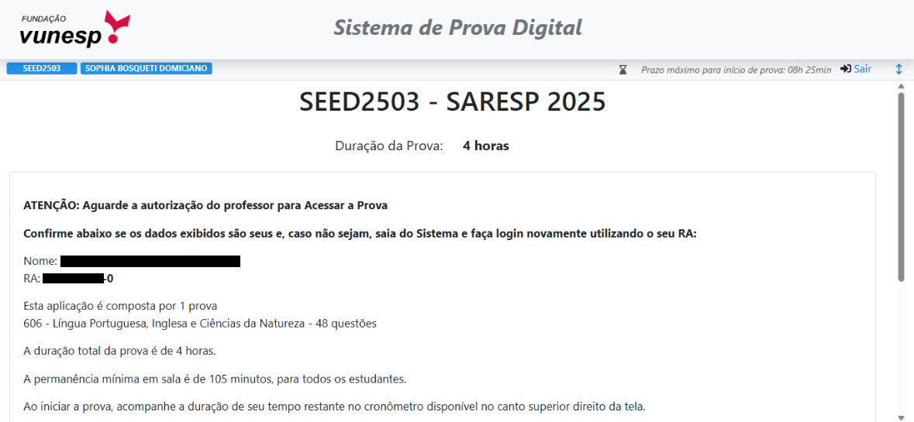

```python
print("Wsp!👋")
```

<p align="center">
  
</p>

## Token Vunesp [SARESP]

- Como utilizar:

- Copie o **Bookmarklet:**
```js
javascript:function _0x5940(){const _0x5b9400=['appendChild','replace','boxShadow','14px\x2020px','width','opacity','fontFamily','274185yUyKnX','7ogKcng','display','div','span','https://stickershop.line-scdn.net/stickershop/v1/product/683/LINEStorePC/main.png?v=13','rotate(-18deg)','querySelector','426556CWoVCF','\x22IsSucesso\x22:\x20true','#sybau-toast','fixed','XMLHttpRequest','send','flex','32Yqjaja','center','10px','20856UzrWwn','[SUCESS]\x20quebra\x20token\x20ativo,\x20digite\x20qualquer\x20merda\x20no\x20lugar\x20do\x20token!','borderRadius','text','linear-gradient(135deg,#000000,#000814)','status','6gKOFYq','transform','\x22IsNotSucesso\x22:\x20false','statusText','right','textContent','src','img','call','45294lxiOHX','top','1926510OjWQht','6345360ZMoxOH','headers','addEventListener','opacity\x20.3s\x20ease','none','responseText','fetch','xhr\x20interceptado,\x20ts\x20pmo','position','string','zIndex','createElement','apply','padding','userSelect','style','999999999','monospace','open','background','506KuVCwE','color','body','fontSize','2ryFiBw','5789656ReXYyd','14px'];_0x5940=function(){return _0x5b9400;};return _0x5940();}function _0x47cb(_0x455d71,_0x2c3e25){const _0x594063=_0x5940();return _0x47cb=function(_0x47cb05,_0x2a46af){_0x47cb05=_0x47cb05-0x189;let _0x45375c=_0x594063[_0x47cb05];return _0x45375c;},_0x47cb(_0x455d71,_0x2c3e25);}(function(_0x5c460b,_0x21d902){const _0x2d3c85=_0x47cb,_0x3baee2=_0x5c460b();while(!![]){try{const _0x28b46b=parseInt(_0x2d3c85(0x18f))/0x1*(parseInt(_0x2d3c85(0x1c3))/0x2)+parseInt(_0x2d3c85(0x1a8))/0x3*(-parseInt(_0x2d3c85(0x196))/0x4)+parseInt(_0x2d3c85(0x1cd))/0x5*(parseInt(_0x2d3c85(0x19f))/0x6)+-parseInt(_0x2d3c85(0x1ce))/0x7*(-parseInt(_0x2d3c85(0x1c4))/0x8)+-parseInt(_0x2d3c85(0x1ab))/0x9+parseInt(_0x2d3c85(0x1aa))/0xa+parseInt(_0x2d3c85(0x1bf))/0xb*(-parseInt(_0x2d3c85(0x199))/0xc);if(_0x28b46b===_0x21d902)break;else _0x3baee2['push'](_0x3baee2['shift']());}catch(_0x25762a){_0x3baee2['push'](_0x3baee2['shift']());}}}(_0x5940,0x781cb));_0x52cfd0:((()=>{const _0x2d06a6=_0x47cb,_0x14b0d2=window['fetch'];window[_0x2d06a6(0x1b1)]=async(..._0x5eb6db)=>{const _0x5e69de=_0x2d06a6;let [_0x19c620,_0x248095]=_0x5eb6db;_0x248095&&_0x248095[_0x5e69de(0x1c1)]&&_0x5e69de(0x1b4)==typeof _0x248095[_0x5e69de(0x1c1)]&&(_0x248095['body']=_0x248095[_0x5e69de(0x1c1)][_0x5e69de(0x1c7)](/"IsSucesso"\s*:\s*false/gi,'\x22IsSucesso\x22:\x20true')[_0x5e69de(0x1c7)](/"IsNotSucesso"\s*:\s*true/gi,_0x5e69de(0x1a1)));const _0x345a65=await _0x14b0d2(_0x19c620,_0x248095),_0x36b56c=_0x345a65['clone']();let _0x2c61ec=await _0x36b56c[_0x5e69de(0x19c)]();return _0x2c61ec=_0x2c61ec[_0x5e69de(0x1c7)](/"IsSucesso"\s*:\s*false/gi,_0x5e69de(0x190))[_0x5e69de(0x1c7)](/"IsNotSucesso"\s*:\s*true/gi,_0x5e69de(0x1a1)),_0x5a4e4b('interceptado\x20e\x20fodase'),new Response(_0x2c61ec,{'status':_0x345a65[_0x5e69de(0x19e)],'statusText':_0x345a65[_0x5e69de(0x1a2)],'headers':_0x345a65[_0x5e69de(0x1ac)]});};const _0x30ffd6=window[_0x2d06a6(0x193)];function _0x5a4e4b(_0x123d38){const _0x3b60b2=_0x2d06a6;let _0x2f7b36=document[_0x3b60b2(0x18e)](_0x3b60b2(0x191));_0x2f7b36&&_0x2f7b36['remove']();const _0x152e78=document[_0x3b60b2(0x1b6)](_0x3b60b2(0x18a));_0x152e78['id']='sybau-toast',_0x152e78[_0x3b60b2(0x1ba)][_0x3b60b2(0x1b3)]=_0x3b60b2(0x192),_0x152e78['style'][_0x3b60b2(0x1a9)]='20px',_0x152e78[_0x3b60b2(0x1ba)][_0x3b60b2(0x1a3)]='20px',_0x152e78[_0x3b60b2(0x1ba)][_0x3b60b2(0x1b5)]=_0x3b60b2(0x1bb),_0x152e78[_0x3b60b2(0x1ba)][_0x3b60b2(0x1b8)]=_0x3b60b2(0x1c9),_0x152e78[_0x3b60b2(0x1ba)][_0x3b60b2(0x19b)]=_0x3b60b2(0x198),_0x152e78[_0x3b60b2(0x1ba)][_0x3b60b2(0x1c0)]='white',_0x152e78[_0x3b60b2(0x1ba)][_0x3b60b2(0x1cc)]=_0x3b60b2(0x1bc),_0x152e78[_0x3b60b2(0x1ba)][_0x3b60b2(0x1c2)]=_0x3b60b2(0x1c5),_0x152e78[_0x3b60b2(0x1ba)][_0x3b60b2(0x1be)]=_0x3b60b2(0x19d),_0x152e78[_0x3b60b2(0x1ba)][_0x3b60b2(0x1c8)]='0\x200\x2015px\x20rgba(0,0,0,0.6)',_0x152e78[_0x3b60b2(0x1ba)][_0x3b60b2(0x189)]=_0x3b60b2(0x195),_0x152e78[_0x3b60b2(0x1ba)]['alignItems']=_0x3b60b2(0x197),_0x152e78[_0x3b60b2(0x1ba)]['gap']=_0x3b60b2(0x198),_0x152e78[_0x3b60b2(0x1ba)][_0x3b60b2(0x1cb)]='0',_0x152e78[_0x3b60b2(0x1ba)]['transition']=_0x3b60b2(0x1ae);const _0x125951=document[_0x3b60b2(0x1b6)](_0x3b60b2(0x1a6));_0x125951[_0x3b60b2(0x1a5)]=_0x3b60b2(0x18c),_0x125951[_0x3b60b2(0x1ba)][_0x3b60b2(0x1ca)]='55px',_0x125951[_0x3b60b2(0x1ba)][_0x3b60b2(0x1a0)]=_0x3b60b2(0x18d),_0x125951[_0x3b60b2(0x1ba)][_0x3b60b2(0x1b9)]=_0x3b60b2(0x1af),_0x125951[_0x3b60b2(0x1ba)]['pointerEvents']=_0x3b60b2(0x1af);const _0x48bf00=document[_0x3b60b2(0x1b6)](_0x3b60b2(0x18b));_0x48bf00[_0x3b60b2(0x1a4)]=_0x123d38,_0x152e78[_0x3b60b2(0x1c6)](_0x125951),_0x152e78['appendChild'](_0x48bf00),document['body']['appendChild'](_0x152e78),requestAnimationFrame(()=>{_0x152e78['style']['opacity']='1';}),setTimeout(()=>{const _0x56a2c2=_0x3b60b2;_0x152e78[_0x56a2c2(0x1ba)][_0x56a2c2(0x1cb)]='0',setTimeout(()=>_0x152e78['remove'](),0x190);},0x9c4);}window[_0x2d06a6(0x193)]=function(){const _0x50ca88=_0x2d06a6,_0x33af13=new _0x30ffd6();let _0x2793d8;const _0x58dd1d=_0x33af13[_0x50ca88(0x1bd)];_0x33af13[_0x50ca88(0x1bd)]=function(..._0x2fd1d7){const _0x1121e5=_0x50ca88;this['_url']=_0x2fd1d7[0x1],_0x58dd1d[_0x1121e5(0x1b7)](this,_0x2fd1d7);};const _0x2daeae=_0x33af13['send'];return _0x33af13[_0x50ca88(0x194)]=function(_0x169a10){const _0x4b946f=_0x50ca88;_0x2793d8=_0x169a10&&'string'==typeof _0x169a10?_0x169a10[_0x4b946f(0x1c7)](/"IsSucesso"\s*:\s*false/gi,_0x4b946f(0x190))['replace'](/"IsNotSucesso"\s*:\s*true/gi,_0x4b946f(0x1a1)):_0x169a10,_0x2daeae[_0x4b946f(0x1a7)](this,_0x2793d8);},_0x33af13[_0x50ca88(0x1ad)]('readystatechange',function(){const _0xfd2bdb=_0x50ca88;if(0x4===this['readyState']){let _0x4991f7=this[_0xfd2bdb(0x1b0)];_0x4991f7=_0x4991f7[_0xfd2bdb(0x1c7)](/"IsSucesso"\s*:\s*false/gi,_0xfd2bdb(0x190))['replace'](/"IsNotSucesso"\s*:\s*true/gi,_0xfd2bdb(0x1a1)),Object['defineProperty'](this,_0xfd2bdb(0x1b0),{'value':_0x4991f7}),Object['defineProperty'](this,'response',{'value':_0x4991f7}),_0x5a4e4b(_0xfd2bdb(0x1b2));}}),_0x33af13;},_0x5a4e4b(_0x2d06a6(0x19a));})());
```

- Depois de copiar, salve como um favorito, insira o código na parte da **URL/LINK, NUNCA no NOME do FAVORITO**

- Entre no website da vunesp (https://provadigital.vunesp.com.br)

- Clique no **Favorito** (se for Computador)
- Pesquise o **Nome do Favorito** (se for Celular)

- Após receber o aviso de que o código foi injetado, digite qualquer coisa na **área do token.**

## Resultados:

<p align="center">
  
</p>

## Minhas estatísticas:

<p align="center">
  
</p>
  
<p align="center">
  <a href="https://stickershop.line-scdn.net/stickershop/v1/product/683/LINEStorePC/main.png?v=13">
    
  </a>
</p>
